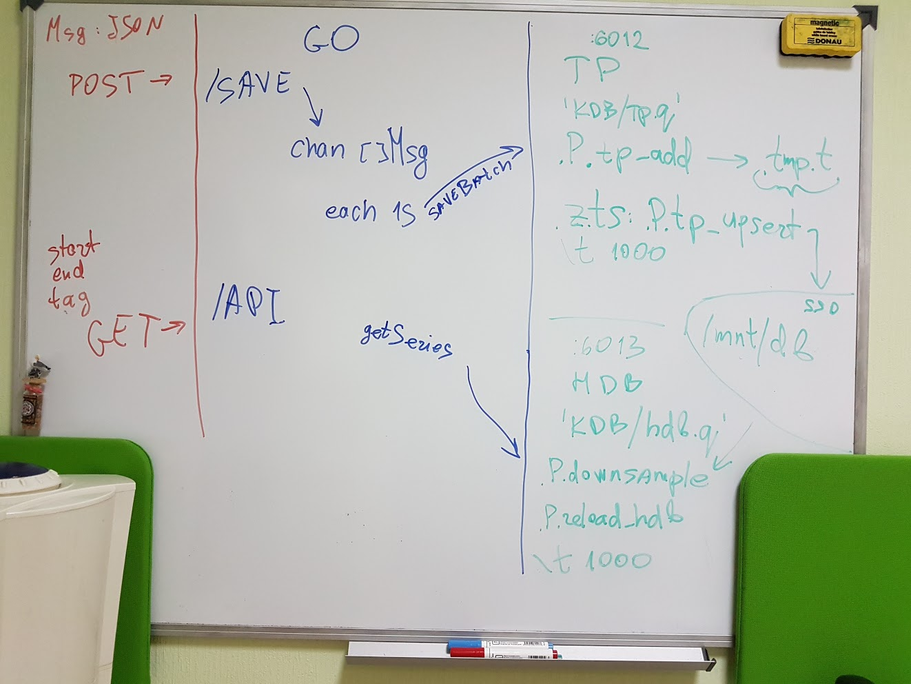

# Overview

This deliverable consists of Go(Gin framework, easyjson, kdbgo) and kdb+ 32bit
as a database, according to "Specification" section below. It's intended to be run
in a "host" network_mode(to avoid 'docker-proxy' overhead) using docker-compose. 

Two API endpoints are provided:

- `GET /api?tag=<string>&start=<int64>&end=<int64>` for client aggregated calls

- `POST /save` for incoming JSON messages

Message format is: `{"time":<int64>, "tag":"<string>", "values":[<float64>, ...]}`

See api.go for response format: `{"tagName":<t>, "start": <int64>, "end": <int64>,
 "samples": [{"time": <int64>, "values": [<float64>,...]]}`

Incoming JSON messages are buffered and sent as a batch to kdb+ once per second.

There are two instances of kdb, sharing the same database - one for writing batches(tp),
and one for aggregation queries(hdb).

On-disk kdb+ table is a partitioned table, decomposed by `int` virtual columns, that
represent an index of a tag in `sym`.

Saving a batch is a peach upsert to in-memory .tmp.t table. Once per second `tp` instance
is calling .P.tp_upsert, persisting this table to disk, partitioning by tag.


# Installation (using AWS EC2, Ubuntu 16.04 as example)
1. prepare ec2 instance and put code to /home/ubuntu/go/src/poc dir:
e.g. to push code from host

	`$ rsync -zr --exclude vendor . ubuntu@ec2host://home/ubuntu/go/src/poc`

2. Install docker-ce, docker-compose and recent go version:
make sure to use SSD and 'overlay2' storage driver, use ext4 or btrfs
aufs is too slow for intensive writes
see this script for details

	`$ sudo ./ec2_16.04_setup.sh`


3. build static binary and run docker-compose:
app starts on http://0.0.0.0:8080

	`$ sudo ./start.sh`


# Testing
## unit tests:

`$ go test`

integration tests: 10K rps and client latency read

start app beforehand first with ./start.sh

available ENV variables: RATE(rps, default: 10000), DURATION(seconds, default: 10)

`$ URL=http://<host>:8080 DURATION=10 RATE=10000 go test`

## load test:

`$ wrk -d 10s -s post.lua http://<host>:8080/save`


# Technical details


There's a `Database` interface, abstracting DB work. Other DBs should implement it.
KDB+ implementation is at kdb.go(influxDB and cassandra were implemented,
but dropped due to missing performance targets in commit 'edec207').

`main()` function starts two goroutines(in `db.startQueueConsumer()`):

- msgChan listener and appender to `rows` in kdb+ format, using kdbgo. it pushes batches 
   to `db.out` channel by timer(each 1s)

- infinite loop for `db.saveBatch()`, that reads `db.out` channel and sends the batch
   to `tp` on port 6012, invoking `.P.tp_add` function, appending batch to `.tmp.t` in-memory
   table.

Incoming messages are received by Gin framework framework 'saveHandler', parsed into
`Msg` structs and added to `msgChan`.

On-disk kdb+ table is a partitioned table, one spliced table per tag. They are stored
in `int`-named directories, and loaded to `t` table, with `int` virtual column, `int$`sym
representing a partition domain. Each spliced partition is ordered by `ts` timestamp field.

This way `hdb` queries on `t` only load one partition and are fast. The downside is that
batch save updates thousands of partitions each time. It's fairly fast using peach, utilising
several cores via slaves and working on 30000+ IOPS SSD, though 


Go dependencies are vendored using 'dep' tool(Gopkg.toml, Gopkg.lock). To update them:

`$ go get -u github.com/golang/dep/...`
`$ dep ensure -update`


# Hardware requirements and test results
Tested on amazon EC2 c3.8xlarge, /var/lib/docker softlinked to ext4 SSD partition.
'overlay2' for docker storage backend.

Integration and load tests were ran from another EC2 instance(c4.4xlarge).

```
1) Pipelined 50K rps with 10 client requests per second, checking that data was
written correctly and can be retrieved:

$ URL=http://172.31.27.64:8080 DURATION=60 RATE=50000 go test -v -run

> stats: map[100+:0 10:0 50:599 99:1]

i.e. all client requests are under 50ms


$ URL=http://172.31.27.64:8080 DURATION=1 RATE=200000 go test -v -run Test2sLag

> stats: map[10:0 50:10 99:0 100+:0]

--- PASS: Test2sLag (3.15s)


2) Load testing with 4 threads and 40 concurrent connections:

$ wrk -t 4 -c 40 -d 360s -s post.lua http://172.31.27.64:8080/save
Running 6m test @ http://172.31.27.64:8080/save
		4 threads and 40 connections
		Thread Stats   Avg      Stdev     Max   +/- Stdev
		Latency   324.60us  547.77us  24.83ms   96.76%
		Req/Sec    34.03k     2.22k   38.30k    78.12%
	13127072 requests in 1.62m, 1.66GB read
Requests/sec: 135459.38
Transfer/sec:     17.57MB


CPU utilisation(provided by atop):
5575 root        63  45.38s   58.60s     0K     68K     0K      0K  --   -  S    27  1311% poc
5482 root        17  14.03s   53.98s     0K     68K     0K  125.6M  --   -  S    16  858% q


Typical batch insert times:
> 23.6859ms 10000
> 129.654945ms 50001
> 432.849312ms 138450
```


# Specification
```
The task is to design the PoC of service that consumes incoming data and exposes 1 API function as described
below with no more than 1$ per hour of 3-year amortized hardware budget.

-  Incoming data source publishes JSON messages with measurements for a set of different tags with the following properties:
	-       Each message consists of nanosecond timestamp, string tag (less than 20 characters), and 10 64-bit float measurements.
	-       Measurement values for each tag do not change much between timestamps.
	-       There are 10k different tags.
	-       First tag comprises 1% of all messages; second tag comprises 1% of remaining messages, and so on.
	-       Long-term average rate of message is 10k mps (messages per second).
	-       1-minute peaks can reach up to 50k mps (3m in one minute).
	-       1-second peaks can reach up to 200k mps.

-  Exposed service should provide RESTful API (single function) to retrieve downsampled time series of measurements for an individual tag:
	-       Function parameters are tag, interval start timestamp, and interval end timestamp.
	-       Function returns JSON with 1000 samples of all 10 measurements for the provided tag and interval (i.e. if requested time interval is 1 hour, then measurements should be sampled at the end of every 36 second period).
	-       Interval starts no more than 24 hours from current time.
	-       Requested interval at least 10 minutes.
	-       When function is called 1 times per second from 10 clients (10 requests per second) for top 100 most frequent symbols, function should take no more than 100ms for 99% of requests.
	-       Returned data should not be lagging for more than 2 seconds relative to data published by the producer.

-  Deliverable should:
	-       Consist of docker-compose.yml and description how to operate the services.
	-       Have test data produced and test clients as separate services.
	-       Run on the latest version of Docker Compose on Internet-connected x64 Linux.
	-       Have hardware requirements either in form of public cloud instance configuration or direct hardware configuration (vCPU count, RAM size, permanent storage size and provisioned IOPS)

-  Implementation considerations (these are NOT the requirements):
	-       Potential to have HA setup that can survive any single VM failure without data loss or service interruption
	-       Potential to scale:
          -       Number of tags and incoming message rates by 10x
          -      Frequency of client requests by 10x
          -       Maximum lookup window to 1 month
	-       Potential to add performance monitoring
	-       Potential to perform more complex queries on measurements (like min, max, weighted average, moving average, etc)
	- Potential to record and quickly export raw data
```
